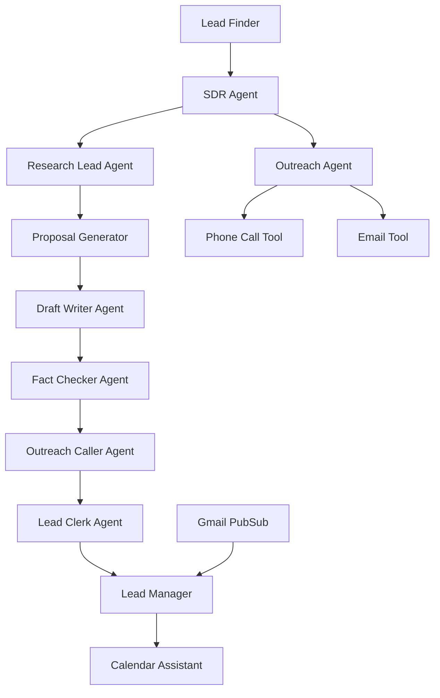

# 🚀 SalesShortcut - AI-Powered SDR Agent System

A comprehensive AI-powered Sales Development Representative (SDR) system built with multi-agent architecture for automated lead generation, research, proposal generation, and outreach.

## 🎯 Project Overview

SalesShortcut is a sales automation and engagement platform that **finds, creates, and converts leads** through intelligent AI agents. The system automatically discovers potential business leads, researches their needs, creates personalized proposals, and manages outreach campaigns including phone calls and email communication.

## 🏗️ Architecture


SalesShortcut consists of 5 specialized microservices working together:

### Core Services

- **🔍 [Lead Finder](./lead_finder/README.md)** - Discovers potential business leads in specified cities using Google Maps and location-based search
- **🧠 [SDR Agent](./sdr/README.md)** - Main orchestrator conducting research, proposal generation, and outreach (includes phone calls and email)
- **📋 [Lead Manager](./lead_manager/README.md)** - Manages lead data, tracks conversion status, and handles meeting scheduling
- **🖥️ [UI Client](./ui_client/README.md)** - Web dashboard for monitoring and controlling the entire system
- **📧 [Gmail PubSub Service](./gmail_pubsub_listener/README.md)** - Handles incoming email responses and lead engagement tracking

### Agent Workflow



## ✨ Key Features

### Lead Generation
- **Geographic targeting** - Find businesses in any specified city
- **Google Maps integration** - Leverage Maps API for accurate business data
- **Intelligent clustering** - Group similar businesses for targeted campaigns

### AI-Powered Research
- **Comprehensive business analysis** - Understand target business needs and pain points  
- **Competitor research** - Analyze market position and opportunities
- **Review analysis** - Extract insights from customer feedback
- **Website assessment** - Identify digital presence gaps

### Personalized Outreach
- **Custom proposal generation** - AI-crafted proposals based on research findings
- **Multi-channel communication** - Phone calls via ElevenLabs + email outreach
- **Professional voice calls** - Natural AI voice conversations with prospects
- **Email automation** - SMTP-based email delivery with personalized content

### Lead Management
- **Automated follow-up** - Track engagement and schedule next actions
- **Status tracking** - Monitor leads through the entire sales funnel
- **Meeting scheduling** - Integrate with calendar systems for appointments
- **Data persistence** - Store all interactions in BigQuery for analytics

## 🛠️ Technology Stack

- **Framework**: Python with FastAPI and Google ADK Agents
- **AI Models**: Gemini 2.0 Flash Lite (configurable)
- **Voice**: ElevenLabs API for natural phone conversations
- **Database**: Google BigQuery for data storage and analytics
- **APIs**: Google Maps, Google Search, SMTP for email
- **Frontend**: HTML/CSS/JavaScript with WebSocket real-time updates
- **Deployment**: Docker containers with Cloud Run support

## 📋 Prerequisites

- Python 3.9+
- Google Cloud Project with BigQuery enabled
- API Keys:
  - Google API Key (for Gemini LLM)
  - Google Maps API Key
  - ElevenLabs API Key (for voice calls)
  - Optional: OpenAI, Anthropic keys

## 🚀 Quick Start

### 1. Clone and Setup

```bash
git clone <repository-url>
cd SalesShortcut
cp config.template .env
# Edit .env with your API keys
```

### 2. Environment Configuration

Update `.env` with your API credentials:

```env
# Required
GOOGLE_API_KEY=your_google_api_key_here
GOOGLE_MAPS_API_KEY=your_maps_api_key_here
GOOGLE_CLOUD_PROJECT=your_gcp_project_id_here

# For Voice Calls
ELEVENLABS_API_KEY=your_elevenlabs_key_here
ELEVENLABS_AGENT_ID=your_agent_id_here
ELEVENLABS_PHONE_NUMBER_ID=your_phone_number_id_here

# Email Configuration
EMAIL_USERNAME=your_email@gmail.com
EMAIL_PASSWORD=your_app_password_here
FROM_EMAIL=your_email@gmail.com

# Optional
OPENAI_API_KEY=your_openai_key_here
ANTHROPIC_API_KEY=your_anthropic_key_here
```

### 3. Install Dependencies

```bash
# Install all dependencies
pip install -r requirements.txt

# Or install individual service dependencies
pip install -r lead_finder/requirements.txt
pip install -r lead_manager/requirements.txt
pip install -r sdr/requirements.txt
pip install -r ui_client/requirements.txt
pip install -r gmail_pubsub_listener/requirements.txt
```

### 4. Run the System

#### Option A: Run All Services Locally
```bash
# Start all services
./deploy_local.sh

# Or start individual services
python -m lead_finder --port 8081
python -m lead_manager --port 8082
python -m sdr --port 8084  
python -m ui_client --port 8000
python -m gmail_pubsub_listener --port 8083
```

#### Option B: Docker Deployment
```bash
# Build and deploy with Docker
make build-all
make deploy-local
```

#### Option C: Cloud Run Deployment
```bash
# Deploy to Google Cloud Run
./deploy_cloud_run.sh
```

### 5. Access the Dashboard

Open your browser to `http://localhost:8000` to access the web interface.

## 📖 Service Documentation

Each service has its own detailed README with specific installation and configuration instructions:

- **[🔍 Lead Finder](./lead_finder/README.md)** - Find potential leads using Google Maps
- **🧠 [SDR Agent](./sdr/README.md)** - Research and outreach automation
- **📋 [Lead Manager](./lead_manager/README.md)** - Lead qualification and meeting scheduling
- **🖥️ [UI Client](./ui_client/README.md)** - Web dashboard and monitoring
- **📧 [Gmail PubSub Service](./gmail_pubsub_listener/README.md)** - Email response handling

## 🔧 Environment Variables

### Global Configuration (.env)

| Variable | Description | Required |
|----------|-------------|----------|
| `GOOGLE_API_KEY` | Google API key for Gemini LLM | Yes |
| `GOOGLE_MAPS_API_KEY` | Google Maps API key | Yes |
| `GOOGLE_CLOUD_PROJECT` | GCP project ID for BigQuery | Yes |
| `ELEVENLABS_API_KEY` | ElevenLabs API key for voice calls | Optional |
| `EMAIL_USERNAME` | SMTP email username | Optional |
| `EMAIL_PASSWORD` | SMTP email password | Optional |

### Service-Specific Configuration

Each service can have its own `.env` file for service-specific settings:

- `lead_finder/.env` - Lead finder specific settings
- `lead_manager/.env` - Lead manager specific settings  
- `sdr/.env` - SDR agent specific settings
- `gmail_pubsub_listener/.env` - Gmail service specific settings

## 🐳 Docker Deployment

Each service has its own Dockerfile and can be deployed independently:

```bash
# Build specific service
docker build -f Dockerfile.lead_finder -t salesshortcut-lead-finder .
docker build -f Dockerfile.sdr -t salesshortcut-sdr .
docker build -f Dockerfile.lead_manager -t salesshortcut-lead-manager .
docker build -f Dockerfile.ui_client -t salesshortcut-ui-client .

# Deploy to Cloud Run
./deploy_cloud_run.sh
```

## 📊 Data Storage

The system uses Google BigQuery for persistent storage:

- **Lead Data**: Business information, contact details, research results
- **Interaction History**: Call transcripts, email responses, follow-up activities  
- **Analytics**: Conversion metrics, campaign performance data

## 🔐 Security & Privacy

- All API keys stored securely in environment variables
- Phone calls comply with telemarketing regulations
- Business data encrypted in transit and at rest
- No sensitive information logged or exposed

## 📖 Usage Guide

### Finding Leads

1. **Enter Target City**: Use the web interface to specify a city for lead generation
2. **Automatic Discovery**: The system finds businesses without websites in that area
3. **View Results**: Monitor discovered leads in the dashboard

### SDR Process

1. **Select Leads**: Choose businesses from the lead finder results
2. **Automated Research**: SDR agent researches each business thoroughly
3. **Proposal Generation**: AI creates personalized website development proposals
4. **Phone Outreach**: System makes professional calls to business owners
5. **Email Follow-up**: Sends detailed proposals via email to interested prospects
6. **Lead Tracking**: Monitors responses and schedules follow-up activities

### Dashboard Features

- **Real-time Updates**: WebSocket-powered live status updates
- **Lead Management**: View, filter, and manage all prospects
- **Call Monitoring**: Track phone call outcomes and transcripts
- **Analytics**: Monitor conversion rates and campaign performance

## 🔧 Configuration

### Model Settings
```python
# In any service's config.py
MODEL = "gemini-2.0-flash-lite"  # or "gpt-4", "claude-3-sonnet"
TEMPERATURE = 0.2
TOP_P = 0.95
TOP_K = 40
```

### Service URLs
Services communicate via HTTP/A2A protocol. Default ports:
- UI Client: 8000
- Lead Finder: 8081  
- Lead Manager: 8082
- Gmail PubSub: 8083
- SDR: 8084

## 🤝 Contributing

1. Fork the repository
2. Create a feature branch
3. Make your changes
4. Add tests if applicable
5. Submit a pull request

## 📄 License

This project is licensed under the MIT License - see the LICENSE file for details.

## 🆘 Support

For issues, questions, or feature requests:

1. Check the troubleshooting section in individual service READMEs
2. Review service logs for error details
3. Open an issue on GitHub with detailed information

---

**Built with ❤️ for automating the sales development process**

