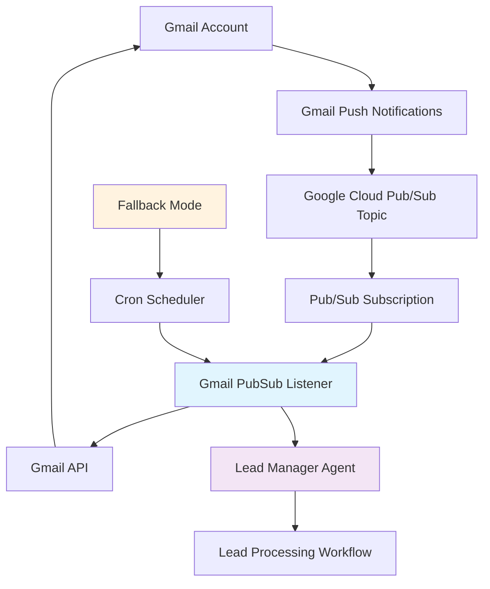

# 📧 Gmail PubSub Listener - Real-time Email Processing Service

The Gmail PubSub Listener is a real-time email monitoring service that uses Google Cloud Pub/Sub to receive instant notifications when new emails arrive at the sales account. It processes email events and triggers the Lead Manager agent for immediate response to prospect communications.

## 🚀 Features

- **Real-time Email Monitoring**: Instant notifications via Google Cloud Pub/Sub
- **Gmail API Integration**: Secure access to sales email account
- **Lead Manager Integration**: Automatic triggering of lead management workflows
- **Fallback Cron Mode**: Polling-based backup when Pub/Sub is unavailable
- **Service Account Authentication**: Secure, unattended operation
- **Comprehensive Logging**: Detailed activity tracking and debugging
- **Health Monitoring**: Connection testing and error recovery
- **Thread-safe Processing**: Concurrent message handling

## 📋 Table of Contents

- [Architecture](#architecture)
- [Installation](#installation)
- [Configuration](#configuration)
- [Usage](#usage)
- [Pub/Sub Setup](#pubsub-setup)
- [Gmail Integration](#gmail-integration)
- [Deployment](#deployment)
- [Monitoring](#monitoring)
- [Troubleshooting](#troubleshooting)

## 🏗️ Architecture

The Gmail PubSub Listener operates as a bridge between Gmail and the SalesShortcut system:



### Core Components

1. **Pub/Sub Listener**: Receives real-time Gmail notifications
2. **Gmail API Client**: Fetches email content and metadata  
3. **Lead Manager Trigger**: Initiates lead processing workflows
4. **Fallback Cron System**: Ensures reliability when Pub/Sub is unavailable
5. **Health Monitoring**: Connection testing and error recovery

### Message Flow

1. **Email Received**: New email arrives at sales account
2. **Pub/Sub Notification**: Gmail sends notification to Pub/Sub topic
3. **Message Processing**: Listener receives and processes notification
4. **Email Fetching**: Gmail API retrieves full email content
5. **Agent Triggering**: Lead Manager agent is invoked for processing
6. **Acknowledgment**: Message is acknowledged upon successful processing

## 🛠️ Installation

### Prerequisites

- Python 3.9+
- Google Cloud Project with enabled APIs:
  - Gmail API
  - Cloud Pub/Sub API
- Service account with domain-wide delegation
- Gmail push notifications configured

### Local Development Setup

1. **Clone the repository**:
```bash
git clone <repository-url>
cd salesshortcut
```

2. **Install dependencies**:
```bash
pip install -r gmail_pubsub_listener/requirements.txt
```

3. **Set environment variables**:
```bash
export PROJECT_ID="your-gcp-project-id"
export SUBSCRIPTION_NAME="gmail-notifications-pull"
export SALES_EMAIL="sales@zemzen.org"
export SERVICE_ACCOUNT_FILE=".secrets/sales-automation-service.json"
export LEAD_MANAGER_URL="http://localhost:8082"
```

4. **Configure service account**:
```bash
# Place your service account key file
mkdir -p .secrets
cp /path/to/service-account-key.json .secrets/sales-automation-service.json
```

5. **Start the service**:
```bash
python gmail_pubsub_listener/gmail_listener_service.py
```

### Docker Installation

1. **Build the Docker image**:
```bash
docker build -f gmail_pubsub_listener/Dockerfile -t salesshortcut-gmail-listener .
```

2. **Run the container**:
```bash
docker run \
  -e PROJECT_ID="your-gcp-project-id" \
  -e SALES_EMAIL="sales@zemzen.org" \
  -e LEAD_MANAGER_URL="http://lead-manager:8082" \
  -v /path/to/service-account.json:/app/.secrets/sales-automation-service.json \
  salesshortcut-gmail-listener
```

## 🔧 Configuration

### Environment Variables

| Variable | Description | Required | Default |
|----------|-------------|----------|---------|
| `PROJECT_ID` | Google Cloud Project ID | Yes | None |
| `SUBSCRIPTION_NAME` | Pub/Sub subscription name | Optional | gmail-notifications-pull |
| `SALES_EMAIL` | Email address to monitor | Yes | None |
| `SERVICE_ACCOUNT_FILE` | Path to service account key | Optional | .secrets/sales-automation-service.json |
| `LEAD_MANAGER_URL` | Lead Manager service URL | Optional | http://localhost:8082 |
| `CRON_INTERVAL` | Fallback polling interval (seconds) | Optional | 30 |

### Service Configuration

Create a `.env` file in the `gmail_pubsub_listener/` directory:

```env
# Google Cloud Configuration
PROJECT_ID=your_gcp_project_id
SUBSCRIPTION_NAME=gmail-notifications-pull
SALES_EMAIL=sales@zemzen.org

# Service Account
SERVICE_ACCOUNT_FILE=.secrets/sales-automation-service.json

# Service URLs
LEAD_MANAGER_URL=http://localhost:8082

# Polling Configuration (fallback mode)
CRON_INTERVAL=30
```

## 📖 Usage

### Starting the Service

```bash
# Start the Gmail PubSub Listener
python gmail_pubsub_listener/gmail_listener_service.py

# Or using Docker
docker run salesshortcut-gmail-listener
```

### Service Modes

#### 1. Pub/Sub Mode (Recommended)
Real-time email notifications via Google Cloud Pub/Sub:

```bash
# Check if Pub/Sub is working
gcloud pubsub subscriptions describe gmail-notifications-pull
```

#### 2. Fallback Cron Mode
Polling-based email checking when Pub/Sub is unavailable:

```bash
# Service automatically falls back to cron mode
# Polls every 30 seconds (configurable)
```

### Testing the Service

```bash
# Send a test email to the monitored address
echo "Test email" | mail -s "Test Subject" sales@zemzen.org

# Check logs for processing
tail -f gmail_listener.log
```

### Manual Triggering

```python
# Test the Lead Manager integration
import requests

response = requests.post(
    "http://localhost:8082/agents/lead-manager-agent/execute",
    json={
        "event_type": "new_email",
        "email_data": {
            "message_id": "test-message",
            "sender": "test@example.com",
            "subject": "Test Email",
            "timestamp": "2025-06-23T12:00:00Z",
            "sales_email": "sales@zemzen.org"
        }
    }
)
```

## 🔔 Pub/Sub Setup

### 1. Create Pub/Sub Resources

```bash
# Create topic for Gmail notifications
gcloud pubsub topics create gmail-notifications

# Create subscription
gcloud pubsub subscriptions create gmail-notifications-pull \
  --topic=gmail-notifications
```

### 2. Configure Gmail Push Notifications

```bash
# Set up Gmail watch request
curl -X POST \
  'https://gmail.googleapis.com/gmail/v1/users/me/watch' \
  -H 'Authorization: Bearer ACCESS_TOKEN' \
  -H 'Content-Type: application/json' \
  -d '{
    "topicName": "projects/YOUR_PROJECT_ID/topics/gmail-notifications",
    "labelIds": ["INBOX"]
  }'
```

### 3. Grant Pub/Sub Permissions

```bash
# Allow Gmail to publish to your topic
gcloud pubsub topics add-iam-policy-binding gmail-notifications \
  --member="serviceAccount:gmail-api-push@system.gserviceaccount.com" \
  --role="roles/pubsub.publisher"

# Allow your service account to subscribe
gcloud pubsub subscriptions add-iam-policy-binding gmail-notifications-pull \
  --member="serviceAccount:YOUR_SERVICE_ACCOUNT@PROJECT_ID.iam.gserviceaccount.com" \
  --role="roles/pubsub.subscriber"
```

## 📬 Gmail Integration

### Service Account Setup

1. **Create service account**:
```bash
gcloud iam service-accounts create gmail-listener-sa \
  --description="Gmail PubSub Listener Service Account" \
  --display-name="Gmail Listener"
```

2. **Enable domain-wide delegation**:
```bash
# In Google Admin Console:
# Security > API Controls > Domain-wide Delegation
# Add client ID with scope:
# https://www.googleapis.com/auth/gmail.readonly
```

3. **Download service account key**:
```bash
gcloud iam service-accounts keys create .secrets/sales-automation-service.json \
  --iam-account=gmail-listener-sa@PROJECT_ID.iam.gserviceaccount.com
```

### Gmail API Integration

The service uses the Gmail API to:

- **Retrieve email metadata**: Sender, subject, date, message ID
- **Fetch email content**: Full message body and attachments
- **Process history changes**: Track new messages efficiently
- **Handle unread emails**: Fallback for missed notifications

### Message Processing

```python
# Example message processing workflow
def process_new_message(self, message_id):
    # 1. Fetch full message from Gmail API
    message = self.gmail_service.users().messages().get(
        userId='me', id=message_id, format='full'
    ).execute()
    
    # 2. Extract headers and metadata
    headers = message['payload'].get('headers', [])
    sender = extract_header_value(headers, 'From')
    subject = extract_header_value(headers, 'Subject')
    
    # 3. Trigger Lead Manager agent
    self.trigger_adk_agent(message_id, sender, subject, message)
```

## 🐳 Deployment

### Docker Deployment

```bash
# Build image
docker build -f gmail_pubsub_listener/Dockerfile -t salesshortcut-gmail-listener .

# Run with environment variables
docker run -d \
  --name gmail-listener \
  -e PROJECT_ID="your-project-id" \
  -e SALES_EMAIL="sales@zemzen.org" \
  -v /path/to/service-account.json:/app/.secrets/sales-automation-service.json \
  salesshortcut-gmail-listener
```

### Cloud Run Deployment

```bash
# Deploy to Google Cloud Run
gcloud run deploy gmail-listener-service \
  --source gmail_pubsub_listener/ \
  --platform managed \
  --region us-central1 \
  --allow-unauthenticated \
  --set-env-vars PROJECT_ID="your-project-id",SALES_EMAIL="sales@zemzen.org"
```

### Kubernetes Deployment

```yaml
# gmail-listener-deployment.yaml
apiVersion: apps/v1
kind: Deployment
metadata:
  name: gmail-listener
spec:
  replicas: 1
  selector:
    matchLabels:
      app: gmail-listener
  template:
    metadata:
      labels:
        app: gmail-listener
    spec:
      containers:
      - name: gmail-listener
        image: salesshortcut-gmail-listener
        env:
        - name: PROJECT_ID
          value: "your-project-id"
        - name: SALES_EMAIL
          value: "sales@zemzen.org"
        volumeMounts:
        - name: service-account
          mountPath: /app/.secrets
          readOnly: true
      volumes:
      - name: service-account
        secret:
          secretName: gmail-service-account
```

### Production Configuration

```bash
# Set production environment variables
export PROJECT_ID="production-project-id"
export SALES_EMAIL="sales@company.com"
export LEAD_MANAGER_URL="https://lead-manager-service-url"
export SUBSCRIPTION_NAME="gmail-notifications-production"
export CRON_INTERVAL="60"  # Less frequent polling in production
```

## 📊 Monitoring

### Health Checks

```python
# Test service connectivity
def test_connection(self):
    # Test Pub/Sub subscription
    subscription = self.subscriber.get_subscription(
        request={"subscription": self.subscription_path}
    )
    
    # Test Gmail API access
    profile = self.gmail_service.users().getProfile(userId='me').execute()
    
    return True
```

### Logging and Metrics

```bash
# Monitor service logs
tail -f gmail_listener.log

# Check Pub/Sub metrics
gcloud monitoring metrics list --filter="resource.type=pubsub_subscription"

# Monitor message processing
grep "Message.*processed" gmail_listener.log | wc -l
```

### Key Metrics

- **Messages Received**: Total Pub/Sub messages processed
- **Processing Success Rate**: Percentage of successfully processed messages
- **Lead Manager Triggers**: Number of agent executions triggered
- **Response Time**: Average time from email receipt to processing
- **Error Rate**: Failed message processing attempts

### Alerting

```python
# Example alerting logic
def check_service_health():
    if not self.check_pubsub_health():
        send_alert("Pub/Sub service unavailable - switched to cron mode")
    
    if not self.gmail_service:
        send_alert("Gmail API access failed - service degraded")
```

## 🔍 Troubleshooting

### Common Issues

#### Pub/Sub Subscription Not Found
```bash
# Check if subscription exists
gcloud pubsub subscriptions describe gmail-notifications-pull

# Create if missing
gcloud pubsub subscriptions create gmail-notifications-pull \
  --topic=gmail-notifications
```

#### Gmail API Authentication Errors
```bash
# Check service account permissions
gcloud iam service-accounts get-iam-policy gmail-listener-sa@PROJECT_ID.iam.gserviceaccount.com

# Verify domain-wide delegation in Google Admin Console
# Security > API Controls > Domain-wide Delegation
```

#### No Messages Received
```bash
# Check Gmail watch status
curl -X GET \
  'https://gmail.googleapis.com/gmail/v1/users/me/watch' \
  -H 'Authorization: Bearer ACCESS_TOKEN'

# Renew watch if expired
curl -X POST \
  'https://gmail.googleapis.com/gmail/v1/users/me/watch' \
  -H 'Authorization: Bearer ACCESS_TOKEN' \
  -d '{
    "topicName": "projects/PROJECT_ID/topics/gmail-notifications",
    "labelIds": ["INBOX"]
  }'
```

#### Lead Manager Connection Issues
```bash
# Test Lead Manager connectivity
curl -X GET http://localhost:8082/health

# Check network connectivity
ping lead-manager-service
```

### Debugging

1. **Enable verbose logging**:
```python
logging.basicConfig(level=logging.DEBUG)
```

2. **Test individual components**:
```python
# Test Pub/Sub connection
listener = GmailPubSubListener()
listener.check_pubsub_health()

# Test Gmail API
listener.gmail_service.users().getProfile(userId='me').execute()

# Test Lead Manager trigger
listener.trigger_adk_agent()
```

3. **Monitor message flow**:
```bash
# Watch Pub/Sub messages
gcloud pubsub subscriptions pull gmail-notifications-pull --auto-ack

# Monitor Gmail API calls
export GOOGLE_CLOUD_TRACE=true
```

### Performance Optimization

1. **Optimize message processing**:
```python
# Use concurrent processing
with ThreadPoolExecutor(max_workers=5) as executor:
    futures = [executor.submit(process_message, msg) for msg in messages]
```

2. **Configure flow control**:
```python
flow_control = pubsub_v1.types.FlowControl(
    max_messages=10,
    max_bytes=1024*1024  # 1MB
)
```

3. **Implement message batching**:
```python
# Process messages in batches
BATCH_SIZE = 5
messages_batch = []
```

## 🔧 Development

### Running in Development Mode

```bash
# Install development dependencies
pip install -r gmail_pubsub_listener/requirements.txt

# Start with debug logging
python -c "
import logging
logging.basicConfig(level=logging.DEBUG)
exec(open('gmail_pubsub_listener/gmail_listener_service.py').read())
"
```

### Testing

```bash
# Unit tests
python -m pytest gmail_pubsub_listener/test/

# Integration tests
python gmail_pubsub_listener/test_integration.py

# Load testing
python gmail_pubsub_listener/test_load.py
```

### Adding New Features

1. **Custom message processing**:
```python
def custom_message_processor(self, message_data):
    # Add custom logic here
    pass
```

2. **Additional integrations**:
```python
def trigger_custom_service(self, email_data):
    # Integrate with other services
    pass
```

## 📄 License

This project is licensed under the MIT License - see the [LICENSE](../LICENSE) file for details.

## 🆘 Support

For issues, questions, or feature requests:

1. Check the [main README](../README.md) for general setup instructions
2. Review the troubleshooting section above
3. Verify Google Cloud Pub/Sub and Gmail API configurations
4. Check service account permissions and domain-wide delegation
5. Review service logs for detailed error information
6. Open an issue on GitHub with detailed information

---

**Built with ❤️ for real-time email processing and lead management**