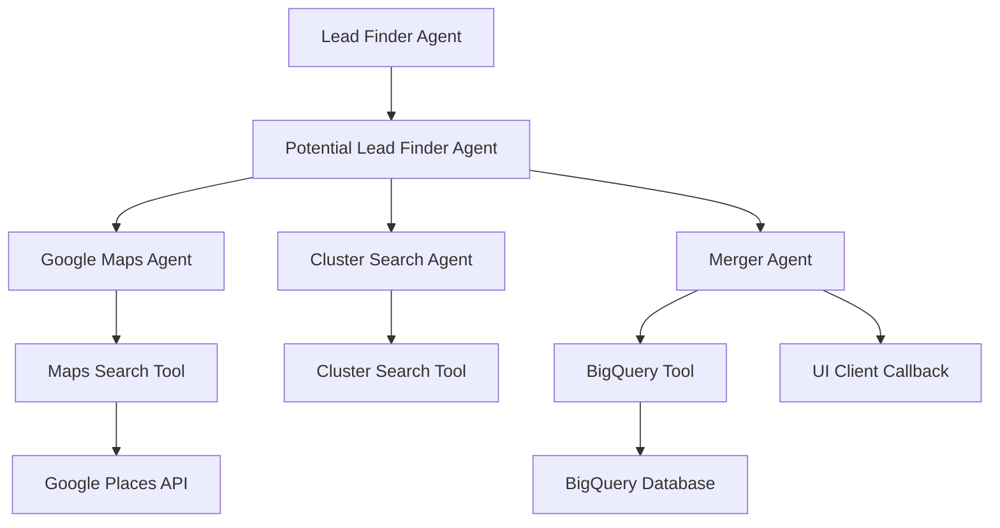

# =
 Lead Finder - Business Lead Discovery Agent

The Lead Finder Agent is a sophisticated multi-agent system designed to discover and process business leads for website development services. It combines Google Maps Places API integration with intelligent business analysis to identify potential customers who lack website presence.

## =€ Features

- **Geographic Business Discovery**: Find businesses in any specified city using Google Maps
- **Multi-Source Data Collection**: Parallel search from Google Maps and custom clusters
- **Intelligent Filtering**: Identify businesses without websites (prime leads for web development)
- **Real-time BigQuery Integration**: Store and manage leads in a structured database
- **Comprehensive Business Data**: Collect contact info, ratings, categories, and location data
- **Deduplication and Validation**: Ensure data quality and uniqueness
- **A2A Integration**: Seamless communication with other SalesShortcut agents
- **UI Client Callbacks**: Real-time updates to the dashboard

## =Ë Table of Contents

- [Architecture](#architecture)
- [Installation](#installation)
- [Configuration](#configuration)
- [Usage](#usage)
- [Sub-Agents](#sub-agents)
- [Tools](#tools)
- [Data Collection](#data-collection)
- [API Documentation](#api-documentation)
- [Development](#development)
- [Deployment](#deployment)
- [Troubleshooting](#troubleshooting)

## <× Architecture

The Lead Finder follows a hierarchical multi-agent architecture with parallel processing capabilities:



### Core Components

1. **Root Agent**: LeadFinderAgent (SequentialAgent)
2. **Coordination Layer**: PotentialLeadFinderAgent (ParallelAgent)
3. **Data Sources**: GoogleMapsAgent, ClusterSearchAgent
4. **Processing Layer**: MergerAgent with deduplication and validation
5. **Storage Layer**: BigQuery integration with structured schemas
6. **Communication Layer**: UI client callbacks and A2A messaging

## =à Installation

### Prerequisites

- Python 3.9+
- Google Cloud Project with enabled APIs:
  - Google Maps Places API
  - BigQuery API
- Google Maps API Key
- Google Cloud authentication

### Local Development Setup

1. **Clone the repository**:
```bash
git clone <repository-url>
cd salesshortcut
```

2. **Install dependencies**:
```bash
pip install -r lead_finder/requirements.txt
```

3. **Set environment variables**:
```bash
export GOOGLE_API_KEY="your-google-api-key"
export GOOGLE_MAPS_API_KEY="your-google-maps-api-key"
export GOOGLE_CLOUD_PROJECT="your-gcp-project-id"
export DATASET_ID="lead_finder_data"
export TABLE_ID="business_leads"
```

4. **Start the Lead Finder service**:
```bash
python -m lead_finder --port 8081
```

### Docker Installation

1. **Build the Docker image**:
```bash
docker build -f Dockerfile.lead_finder -t salesshortcut-lead-finder .
```

2. **Run the container**:
```bash
docker run -p 8081:8081 \
  -e GOOGLE_API_KEY="your-google-api-key" \
  -e GOOGLE_MAPS_API_KEY="your-google-maps-api-key" \
  -e GOOGLE_CLOUD_PROJECT="your-project-id" \
  salesshortcut-lead-finder
```

## =' Configuration

### Environment Variables

| Variable | Description | Required | Default |
|----------|-------------|----------|---------|
| `GOOGLE_API_KEY` | Google API key for LLM | Yes | None |
| `GOOGLE_MAPS_API_KEY` | Google Maps Places API key | Yes | None |
| `GOOGLE_CLOUD_PROJECT` | GCP project ID for BigQuery | Yes | None |
| `DATASET_ID` | BigQuery dataset name | Optional | lead_finder_data |
| `TABLE_ID` | BigQuery table name | Optional | business_leads |
| `MODEL` | LLM model to use | Optional | gemini-2.0-flash-lite |
| `TEMPERATURE` | LLM temperature | Optional | 0.2 |
| `UI_CLIENT_SERVICE_URL` | UI client callback URL | Optional | http://localhost:8000 |

### Service Configuration

Create a `.env` file in the `lead_finder/` directory:

```env
# Core APIs
GOOGLE_API_KEY=your_google_api_key_here
GOOGLE_MAPS_API_KEY=your_google_maps_api_key_here
GOOGLE_CLOUD_PROJECT=your_gcp_project_id

# BigQuery Configuration
DATASET_ID=lead_finder_data
TABLE_ID=business_leads

# LLM Configuration  
MODEL=gemini-2.0-flash-lite
TEMPERATURE=0.2
TOP_P=0.95
TOP_K=40

# Service URLs
UI_CLIENT_SERVICE_URL=http://localhost:8000
```

### Google Cloud Setup

1. **Enable required APIs**:
```bash
gcloud services enable places-backend.googleapis.com
gcloud services enable bigquery.googleapis.com
```

2. **Create service account** (if needed):
```bash
gcloud iam service-accounts create lead-finder-sa \
  --description="Lead Finder Service Account" \
  --display-name="Lead Finder"
```

3. **Grant BigQuery permissions**:
```bash
gcloud projects add-iam-policy-binding $GOOGLE_CLOUD_PROJECT \
  --member="serviceAccount:lead-finder-sa@$GOOGLE_CLOUD_PROJECT.iam.gserviceaccount.com" \
  --role="roles/bigquery.dataEditor"
```

## =Ö Usage

### Starting the Lead Finder

```bash
# Start the Lead Finder service
python -m lead_finder --host 0.0.0.0 --port 8081

# Check service health
curl http://localhost:8081/health
```

### Finding Leads

#### Via UI Client
1. Open the SalesShortcut dashboard
2. Enter a target city name
3. Click "Start Lead Finding"
4. Monitor real-time results in the dashboard

#### Via API Call
```bash
# Start lead finding for a specific city
curl -X POST http://localhost:8081/find_leads \
  -H 'Content-Type: application/json' \
  -d '{"city": "San Francisco"}'
```

#### Via A2A Message
```python
# Send A2A message to Lead Finder
message = {
    "city": "San Francisco",
    "max_results": 50,
    "search_radius": 25000,  # meters
    "exclude_with_websites": True
}
```

### Example Response

```json
{
  "status": "success",
  "city": "San Francisco",
  "results_count": 15,
  "businesses": [
    {
      "name": "Local Pizza Place",
      "address": "123 Main St, San Francisco, CA",
      "phone": "+1-415-555-1234",
      "website": null,
      "category": "restaurant",
      "rating": 4.2,
      "review_count": 87,
      "place_id": "ChIJ...",
      "latitude": 37.7749,
      "longitude": -122.4194,
      "lead_status": "new"
    }
  ]
}
```

## > Sub-Agents

### 1. Lead Finder Agent (Root)
**Type**: SequentialAgent
**Purpose**: Main orchestrator for the lead finding workflow

```python
# Location: lead_finder/lead_finder/agent.py
# Workflow: PotentialLeadFinderAgent ’ MergerAgent
```

**Responsibilities**:
- Initialize the lead finding session
- Coordinate sub-agent execution
- Handle session state management
- Manage error recovery

### 2. Potential Lead Finder Agent
**Type**: ParallelAgent (Fan-out pattern)
**Purpose**: Coordinate parallel searches from multiple data sources

```python
# Location: lead_finder/sub_agents/potential_lead_finder_agent.py
# Sub-agents: GoogleMapsAgent, ClusterSearchAgent (parallel execution)
```

**Features**:
- Parallel execution for faster results
- Multiple data source integration
- Result aggregation from all sources
- Error handling for individual source failures

### 3. Google Maps Agent
**Type**: LlmAgent
**Purpose**: Search businesses using Google Maps Places API

```python
# Location: lead_finder/sub_agents/google_maps_agent.py
# Tools: Google Maps search tool
```

**Capabilities**:
- City-based business search
- Place details collection
- Business category filtering
- Website presence detection
- Rating and review analysis

**Search Parameters**:
- Radius: 25km default
- Max results: 100 per search
- Categories: restaurants, retail, services
- Filters: exclude chains, focus on local businesses

### 4. Cluster Search Agent
**Type**: LlmAgent
**Purpose**: Custom business discovery (currently mock implementation)

```python
# Location: lead_finder/sub_agents/cluster_search_agent.py
# Tools: Cluster search tool
```

**Current Status**: Mock implementation providing sample data
**Future Enhancements**: 
- Web scraping integration
- Business directory searches
- Social media discovery
- Local chamber of commerce data

### 5. Merger Agent
**Type**: LlmAgent
**Purpose**: Process, deduplicate, and store final results

```python
# Location: lead_finder/sub_agents/merger_agent.py
# Tools: BigQuery upload tool
```

**Processing Steps**:
1. Collect results from all parallel agents
2. Remove duplicate businesses (by place_id)
3. Validate data format and completeness
4. Upload to BigQuery with proper schema
5. Send callbacks to UI client
6. Return final merged results

## =à Tools

### 1. Google Maps Search Tool
**File**: `lead_finder/tools/maps_search.py`

```python
from lead_finder.tools.maps_search import search_businesses_google_maps

# Search for businesses in a city
results = search_businesses_google_maps(
    city="San Francisco",
    max_results=50,
    search_radius=25000
)
```

**Features**:
- **Real API Integration**: Full Google Maps Places API
- **Comprehensive Data**: Name, address, phone, website, ratings
- **Smart Filtering**: Exclude businesses with websites
- **Error Handling**: Mock data fallback on API failures
- **Rate Limiting**: Respects API quotas and limits

**Data Collection**:
- Business identity (name, address, place_id)
- Contact information (phone, website)
- Business metrics (rating, review_count, price_level)
- Location data (latitude, longitude)
- Operational info (opening_hours, business_status)
- Category classification

### 2. BigQuery Utils Tool
**File**: `lead_finder/tools/bigquery_utils.py`

```python
from lead_finder.tools.bigquery_utils import upload_leads_to_bigquery

# Upload business leads to BigQuery
success = upload_leads_to_bigquery(
    leads_data=business_leads,
    dataset_id="lead_finder_data",
    table_id="business_leads"
)
```

**Features**:
- **Automatic Schema Management**: Creates datasets and tables
- **Data Validation**: Type checking and field validation
- **Deduplication**: Prevents duplicate entries
- **Batch Operations**: Efficient bulk uploads
- **Error Recovery**: Comprehensive error handling

**Database Schema**:
```sql
CREATE TABLE business_leads (
  place_id STRING NOT NULL,
  name STRING,
  address STRING,
  phone STRING,
  website STRING,
  category STRING,
  rating FLOAT64,
  review_count INT64,
  price_level INT64,
  latitude FLOAT64,
  longitude FLOAT64,
  opening_hours STRING,
  business_status STRING,
  search_type STRING,
  city STRING,
  lead_status STRING,
  created_at TIMESTAMP,
  updated_at TIMESTAMP
);
```

### 3. Cluster Search Tool
**File**: `lead_finder/tools/cluster_search.py`

```python
from lead_finder.tools.cluster_search import search_businesses_clusters

# Custom cluster-based search (currently mock)
results = search_businesses_clusters(
    city="San Francisco",
    max_results=20
)
```

**Current Implementation**: Mock data provider
**Purpose**: Placeholder for future custom business discovery
**Potential Extensions**:
- Web scraping for local directories
- Social media business discovery
- Industry-specific searches

## =Ê Data Collection

### Business Data Structure

```python
business_lead = {
    "place_id": "ChIJ...",              # Google Place ID (unique)
    "name": "Local Business Name",      # Business name
    "address": "123 Main St, City",     # Full address
    "phone": "+1-555-1234",            # Phone number
    "website": None,                    # Website URL (null for leads)
    "category": "restaurant",           # Business category
    "rating": 4.2,                     # Google rating (1-5)
    "review_count": 87,                # Number of reviews
    "price_level": 2,                  # Price level (1-4)
    "latitude": 37.7749,               # GPS latitude
    "longitude": -122.4194,            # GPS longitude
    "opening_hours": "Mon-Fri 9-17",   # Operating hours
    "business_status": "OPERATIONAL",   # Current status
    "search_type": "google_maps",       # Data source
    "city": "San Francisco",           # Search city
    "lead_status": "new",              # Lead lifecycle status
    "created_at": "2025-06-23T12:00:00Z",
    "updated_at": "2025-06-23T12:00:00Z"
}
```

### Lead Quality Filters

1. **Website Filter**: Exclude businesses with existing websites
2. **Category Filter**: Focus on restaurants, retail, services
3. **Rating Filter**: Minimum 3.0 rating for quality leads
4. **Review Filter**: Minimum 5 reviews for established businesses
5. **Status Filter**: Only operational businesses
6. **Location Filter**: Within specified radius of city center

### Data Processing Pipeline

1. **Collection**: Gather raw data from APIs
2. **Validation**: Check data types and required fields
3. **Cleaning**: Sanitize strings, normalize phone numbers
4. **Enrichment**: Add timestamps, lead status, search metadata
5. **Deduplication**: Remove duplicates by place_id
6. **Storage**: Upload to BigQuery with proper schema
7. **Indexing**: Create indexes for fast querying

## = API Documentation

### A2A Integration

```python
# Agent capabilities
capabilities = AgentCapabilities(
    skills=[
        AgentSkill(
            name="find_leads",
            description="Discover business leads in specified cities"
        )
    ]
)
```

### REST Endpoints

```http
# Find leads in a city
POST /find_leads
Content-Type: application/json

{
  "city": "San Francisco",
  "max_results": 50,
  "search_radius": 25000
}

# Check service health
GET /health

# Get agent capabilities
GET /capabilities
```

### WebSocket Updates

The Lead Finder sends real-time updates to the UI client:

```javascript
// Example WebSocket message
{
  "agent_type": "lead_finder",
  "business_id": "ChIJ...",
  "status": "found",
  "message": "Found business: Local Pizza Place",
  "timestamp": "2025-06-23T12:00:00Z",
  "data": {
    "name": "Local Pizza Place",
    "city": "San Francisco",
    "phone": "+1-415-555-1234",
    "category": "restaurant"
  }
}
```

## =à Development

### Running in Development Mode

```bash
# Install development dependencies
pip install -r lead_finder/requirements.txt

# Start with debug logging
python -m lead_finder --port 8081 --log-level DEBUG

# Enable hot reload (if using uvicorn)
uvicorn lead_finder.main:app --reload --port 8081
```

### Project Structure

```
lead_finder/
 __init__.py
 __main__.py                    # Entry point
 agent_executor.py             # A2A agent executor
 lead_finder/                  # Main agent package
    __init__.py
    agent.py                  # Root Lead Finder agent
    config.py                 # Configuration
    prompts.py               # LLM prompts
    utils.py                 # Utility functions
    sub_agents/              # Sub-agent implementations
       potential_lead_finder_agent.py
       google_maps_agent.py
       cluster_search_agent.py
       merger_agent.py
    tools/                   # Tool implementations
        maps_search.py       # Google Maps integration
        bigquery_utils.py    # BigQuery operations
        cluster_search.py    # Custom search tool
 requirements.txt             # Dependencies
```

### Adding New Data Sources

1. **Create a new sub-agent**:
```python
# lead_finder/sub_agents/new_source_agent.py
from google.adk.agents import LlmAgent

class NewSourceAgent(LlmAgent):
    def __init__(self):
        super().__init__(
            name="new_source_agent",
            tools=[new_source_tool]
        )
```

2. **Add to parallel execution**:
```python
# lead_finder/sub_agents/potential_lead_finder_agent.py
sub_agents = [
    GoogleMapsAgent(),
    ClusterSearchAgent(),
    NewSourceAgent(),  # Add here
]
```

3. **Create corresponding tool**:
```python
# lead_finder/tools/new_source.py
def search_new_source(city: str, max_results: int):
    # Implementation
    return business_leads
```

### Testing

```bash
# Run unit tests
pytest lead_finder/test/

# Test Google Maps integration
pytest lead_finder/test/test_maps_search.py

# Test BigQuery operations
pytest lead_finder/test/test_bigquery_utils.py

# Integration test
python lead_finder/test/test_lead_finder_workflow.py
```

## =3 Deployment

### Docker Deployment

```bash
# Build image
docker build -f Dockerfile.lead_finder -t salesshortcut-lead-finder .

# Run with environment variables
docker run -p 8081:8081 \
  -e GOOGLE_API_KEY="your-api-key" \
  -e GOOGLE_MAPS_API_KEY="your-maps-key" \
  -e GOOGLE_CLOUD_PROJECT="your-project" \
  salesshortcut-lead-finder
```

### Cloud Run Deployment

```bash
# Deploy to Google Cloud Run
gcloud run deploy lead-finder-service \
  --source . \
  --platform managed \
  --region us-central1 \
  --allow-unauthenticated \
  --set-env-vars GOOGLE_API_KEY="your-api-key",GOOGLE_MAPS_API_KEY="your-maps-key"
```

### Production Configuration

```bash
# Set production environment variables
export GOOGLE_API_KEY="your-production-api-key"
export GOOGLE_MAPS_API_KEY="your-production-maps-key"
export GOOGLE_CLOUD_PROJECT="your-production-project"
export LOG_LEVEL="WARNING"
export MODEL="gemini-2.0-flash-lite"
```

## =
 Troubleshooting

### Common Issues

#### Google Maps API Errors
```bash
# Check API key and quotas
curl "https://maps.googleapis.com/maps/api/place/findplacefromtext/json?input=San Francisco&inputtype=textquery&key=$GOOGLE_MAPS_API_KEY"

# Verify enabled APIs
gcloud services list --enabled --project=$GOOGLE_CLOUD_PROJECT
```

#### BigQuery Connection Issues
```bash
# Test BigQuery access
bq ls --project_id=$GOOGLE_CLOUD_PROJECT

# Check authentication
gcloud auth application-default print-access-token
```

#### No Results Found
```bash
# Check city name formatting
python -c "import googlemaps; gmaps = googlemaps.Client(key='$GOOGLE_MAPS_API_KEY'); print(gmaps.geocode('San Francisco'))"

# Verify search parameters
curl -X POST http://localhost:8081/find_leads \
  -H 'Content-Type: application/json' \
  -d '{"city": "San Francisco", "max_results": 10}'
```

### Debugging

1. **Enable debug logging**:
```bash
python -m lead_finder --port 8081 --log-level DEBUG
```

2. **Check agent logs**:
```bash
tail -f lead_finder_agent.log
```

3. **Test individual components**:
```python
# Test Google Maps search
from lead_finder.tools.maps_search import search_businesses_google_maps
results = search_businesses_google_maps("San Francisco", max_results=5)

# Test BigQuery upload
from lead_finder.tools.bigquery_utils import upload_leads_to_bigquery
success = upload_leads_to_bigquery(results)
```

### Performance Optimization

1. **Optimize API usage**:
```python
# Use appropriate search radius
SEARCH_RADIUS = 15000  # 15km for dense cities

# Batch BigQuery operations
BATCH_SIZE = 100
```

2. **Cache results**:
```python
# Implement result caching to avoid duplicate searches
```

3. **Parallel processing**:
```python
# Use async operations for better performance
```

## =Ê Monitoring

### Key Metrics

```python
# Track lead discovery metrics
leads_found_per_city = total_leads / cities_searched
api_success_rate = successful_calls / total_api_calls
data_quality_score = valid_leads / total_leads_collected
```

### Health Checks

```bash
# Monitor service health
curl http://localhost:8081/health

# Check Google Maps quota
curl "https://maps.googleapis.com/maps/api/place/findplacefromtext/json?input=test&inputtype=textquery&key=$GOOGLE_MAPS_API_KEY"
```

### Logging

```python
# Structured logging for analytics
logger.info("Lead finding completed", extra={
    "city": city,
    "leads_found": len(results),
    "api_calls": api_call_count,
    "duration_seconds": workflow_duration
})
```

## =Ä License

This project is licensed under the MIT License - see the [LICENSE](../LICENSE) file for details.

## <˜ Support

For issues, questions, or feature requests:

1. Check the [main README](../README.md) for general setup instructions
2. Review the troubleshooting section above
3. Verify Google Maps API key and quotas
4. Check BigQuery permissions and project configuration
5. Review agent logs for detailed error information
6. Open an issue on GitHub with detailed information

---

**Built with d for intelligent business lead discovery**