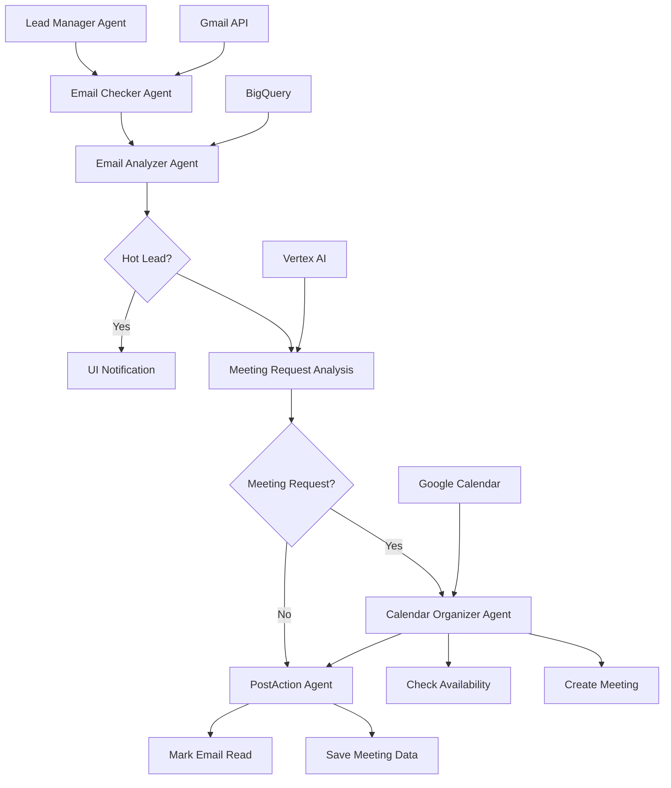

# =Ë Lead Manager - Sales Lead Qualification & Meeting Scheduler

The Lead Manager is a sophisticated email monitoring and meeting scheduling system that automatically processes incoming emails, identifies hot leads, analyzes meeting requests using AI, and schedules appointments with Google Calendar integration. It serves as the critical bridge between initial lead contact and conversion to scheduled meetings.

## =€ Features

- **Real-time Gmail Monitoring**: Continuous monitoring of sales emails for immediate response
- **Hot Lead Detection**: Intelligent lead qualification using database cross-referencing
- **AI-Powered Email Analysis**: Vertex AI integration for meeting request detection
- **Automatic Meeting Scheduling**: Google Calendar integration with Google Meet links
- **Professional Communication**: Branded templates and standardized messaging
- **Real-time Dashboard Updates**: Live notifications to the UI client
- **Data Persistence**: BigQuery integration for comprehensive tracking
- **Service Account Authentication**: Secure API access without manual intervention

## =Ë Table of Contents

- [Architecture](#architecture)
- [Installation](#installation)
- [Configuration](#configuration)
- [Usage](#usage)
- [Sub-Agents](#sub-agents)
- [Tools](#tools)
- [Workflow](#workflow)
- [API Documentation](#api-documentation)
- [Development](#development)
- [Deployment](#deployment)
- [Troubleshooting](#troubleshooting)

## <× Architecture

The Lead Manager follows a sequential agent architecture with sophisticated email processing and calendar integration:



### Core Components

1. **Email Processing Pipeline**: Gmail API integration for real-time monitoring
2. **Lead Qualification System**: Database cross-referencing for hot lead identification
3. **AI Analysis Engine**: Vertex AI for intelligent meeting request detection
4. **Calendar Management**: Google Calendar with Google Meet integration
5. **Data Persistence**: BigQuery storage with local backup systems
6. **Real-time Notifications**: UI dashboard integration

## =à Installation

### Prerequisites

- Python 3.9+
- Google Cloud Project with enabled APIs:
  - Gmail API
  - Google Calendar API
  - BigQuery API
  - Vertex AI API
- Service account with domain-wide delegation
- Google Workspace admin access

### Local Development Setup

1. **Clone the repository**:
```bash
git clone <repository-url>
cd salesshortcut
```

2. **Install dependencies**:
```bash
pip install -r lead_manager/requirements.txt
```

3. **Set environment variables**:
```bash
export GOOGLE_API_KEY="your-google-api-key"
export GOOGLE_CLOUD_PROJECT="your-gcp-project-id"
export SALES_EMAIL="sales@zemzen.org"
export CALENDAR_ID="primary"
export UI_CLIENT_SERVICE_URL="http://localhost:8000"
```

4. **Configure service account**:
```bash
# Set up Google Cloud authentication
export GOOGLE_APPLICATION_CREDENTIALS="/path/to/service-account-key.json"
```

5. **Start the Lead Manager service**:
```bash
python -m lead_manager --port 8082
```

### Docker Installation

1. **Build the Docker image**:
```bash
docker build -f Dockerfile.lead_manager -t salesshortcut-lead-manager .
```

2. **Run the container**:
```bash
docker run -p 8082:8082 \
  -e GOOGLE_API_KEY="your-google-api-key" \
  -e GOOGLE_CLOUD_PROJECT="your-project-id" \
  -e SALES_EMAIL="sales@zemzen.org" \
  -v /path/to/service-account.json:/app/service-account.json \
  -e GOOGLE_APPLICATION_CREDENTIALS="/app/service-account.json" \
  salesshortcut-lead-manager
```

## =' Configuration

### Environment Variables

| Variable | Description | Required | Default |
|----------|-------------|----------|---------|
| `GOOGLE_API_KEY` | Google API key for Vertex AI | Yes | None |
| `GOOGLE_CLOUD_PROJECT` | GCP project ID | Yes | None |
| `SALES_EMAIL` | Email address to monitor | Yes | sales@zemzen.org |
| `CALENDAR_ID` | Google Calendar ID | Optional | primary |
| `UI_CLIENT_SERVICE_URL` | UI client callback URL | Optional | http://localhost:8000 |
| `BUSINESS_HOURS_START` | Meeting start time | Optional | 9 |
| `BUSINESS_HOURS_END` | Meeting end time | Optional | 18 |
| `MEETING_DURATION` | Default meeting length (min) | Optional | 60 |
| `AVAILABILITY_DAYS` | Days to check ahead | Optional | 7 |

### Service Configuration

Create a `.env` file in the `lead_manager/` directory:

```env
# Core APIs
GOOGLE_API_KEY=your_google_api_key_here
GOOGLE_CLOUD_PROJECT=your_gcp_project_id
SALES_EMAIL=sales@zemzen.org

# Calendar Configuration
CALENDAR_ID=primary
BUSINESS_HOURS_START=9
BUSINESS_HOURS_END=18
MEETING_DURATION=60
AVAILABILITY_DAYS=7

# Service URLs
UI_CLIENT_SERVICE_URL=http://localhost:8000

# Service Account (for Docker)
GOOGLE_APPLICATION_CREDENTIALS=/app/service-account.json
```

### Google Workspace Setup

1. **Create service account**:
```bash
gcloud iam service-accounts create lead-manager-sa \
  --description="Lead Manager Service Account" \
  --display-name="Lead Manager"
```

2. **Enable domain-wide delegation**:
```bash
# In Google Admin Console:
# Security > API Controls > Domain-wide Delegation
# Add client ID with scopes:
# https://www.googleapis.com/auth/gmail.readonly
# https://www.googleapis.com/auth/gmail.modify
# https://www.googleapis.com/auth/calendar
```

3. **Grant BigQuery permissions**:
```bash
gcloud projects add-iam-policy-binding $GOOGLE_CLOUD_PROJECT \
  --member="serviceAccount:lead-manager-sa@$GOOGLE_CLOUD_PROJECT.iam.gserviceaccount.com" \
  --role="roles/bigquery.dataEditor"
```

## =Ö Usage

### Starting the Lead Manager

```bash
# Start the Lead Manager service
python -m lead_manager --host 0.0.0.0 --port 8082

# Check service health
curl http://localhost:8082/health
```

### Monitoring Email Responses

The Lead Manager automatically monitors the configured email address for unread emails. When emails are received:

1. System checks if sender is a hot lead
2. Analyzes email content for meeting requests
3. Schedules meetings if requests are detected
4. Sends real-time notifications to dashboard

### Manual Testing

```bash
# Trigger lead management workflow
curl -X POST http://localhost:8082/process_emails \
  -H 'Content-Type: application/json'

# Check for specific email
curl -X POST http://localhost:8082/analyze_email \
  -H 'Content-Type: application/json' \
  -d '{
    "sender": "prospect@company.com",
    "subject": "Meeting Request",
    "body": "I would like to schedule a meeting next week"
  }'
```

### Scheduling Meetings

```bash
# Create meeting manually
curl -X POST http://localhost:8082/schedule_meeting \
  -H 'Content-Type: application/json' \
  -d '{
    "attendee_email": "prospect@company.com",
    "title": "Business Consultation",
    "duration": 60
  }'
```

## > Sub-Agents

### 1. Email Checker Agent
**Purpose**: Retrieve and structure unread emails from Gmail

```python
# Location: lead_manager/sub_agents/email_checker_agent.py
# Tools: check_email_tool
# Output: Structured list of unread emails
```

**Capabilities**:
- Gmail API integration with service account authentication
- Email body extraction from multiple MIME types
- Thread conversation history tracking
- Email metadata extraction (sender, subject, date, message ID)
- Handles multi-part messages and nested content

### 2. Email Analyzer Agent
**Purpose**: Analyze emails to identify hot leads and meeting requests

```python
# Location: lead_manager/sub_agents/email_analyzer.py
# Tools: check_hot_lead_tool, is_meeting_request_llm
# Output: Lead qualification and meeting request analysis
```

**Features**:
- Hot lead verification against database
- AI-powered meeting request detection using Vertex AI
- Real-time UI notifications for hot leads
- Robust JSON parsing with fallback mechanisms
- Intent recognition for explicit and implicit meeting requests

### 3. Calendar Organizer Agent
**Purpose**: Schedule meetings with hot leads

```python
# Location: lead_manager/sub_agents/calendar_organizer_agent.py
# Tools: check_availability_tool, create_meeting_tool
# Output: Scheduled calendar events with Google Meet links
```

**Features**:
- Calendar availability checking (business hours only)
- Google Meet integration for video calls
- Professional meeting descriptions with agenda templates
- Automatic email invitations to attendees
- Conflict detection and resolution

### 4. Post Action Agent
**Purpose**: Finalize the booking process and clean up

```python
# Location: lead_manager/sub_agents/post_action_agent.py
# Tools: mark_email_read_tool, save_meeting_tool
# Output: Completion status and data persistence
```

**Workflow**:
1. Confirm meeting was successfully created
2. Save meeting data to BigQuery
3. Mark original email as read
4. Generate final completion notification

## =à Tools

### 1. Email Management Tools
**File**: `lead_manager/tools/check_email.py`

```python
from lead_manager.tools.check_email import check_email_tool

# Retrieve unread emails
emails = check_email_tool.run(email_address="sales@zemzen.org")
```

**Features**:
- **Service Account Authentication**: Secure Gmail API access
- **Multi-format Support**: Handles text/plain, text/html, multipart
- **Thread Management**: Extracts conversation history
- **Metadata Extraction**: Complete email information

### 2. Calendar Management Tools
**File**: `lead_manager/tools/calendar_utils.py`

```python
from lead_manager.tools.calendar_utils import check_availability_tool, create_meeting_tool

# Check calendar availability
availability = check_availability_tool.run(
    calendar_id="primary",
    days_ahead=7
)

# Create meeting
meeting = create_meeting_tool.run(
    calendar_id="primary",
    title="Business Consultation",
    attendee_email="prospect@company.com",
    duration=60
)
```

**Features**:
- **Business Hours Scheduling**: 9 AM - 6 PM, weekdays only
- **Google Meet Integration**: Automatic video conference links
- **Professional Templates**: Standardized meeting descriptions
- **Timezone Handling**: Automatic timezone conversion

### 3. AI Analysis Tool
**File**: `lead_manager/tools/meeting_request_llm.py`

```python
from lead_manager.tools.meeting_request_llm import is_meeting_request_llm

# Analyze email for meeting requests
analysis = is_meeting_request_llm(
    email_body="I would like to schedule a meeting next week",
    sender="prospect@company.com"
)
```

**Features**:
- **Vertex AI Integration**: Gemini model for intelligent analysis
- **Structured Output**: JSON responses with confidence scores
- **Fallback Detection**: Keyword-based backup analysis
- **Intent Recognition**: Identifies explicit and implicit requests

### 4. Data Management Tools
**File**: `lead_manager/tools/bigquery_utils.py`

```python
from lead_manager.tools.bigquery_utils import check_hot_lead_tool, save_meeting_tool

# Check if sender is a hot lead
is_hot_lead = check_hot_lead_tool.run(
    email_address="prospect@company.com"
)

# Save meeting data
save_meeting_tool.run(meeting_data)
```

**Features**:
- **Hot Lead Database**: Cross-reference against qualified leads
- **Meeting Persistence**: BigQuery storage with JSON backup
- **Audit Trail**: Comprehensive activity logging
- **Data Validation**: Schema enforcement and error handling

## =Ê Workflow

### Complete Lead Management Process

1. **Email Monitoring Phase**:
   - Monitor Gmail for unread emails
   - Extract email content and metadata
   - Structure data for analysis

2. **Lead Qualification Phase**:
   - Check sender against hot leads database
   - Send UI notification if hot lead found
   - Continue to content analysis regardless

3. **Meeting Request Detection**:
   - Use AI/LLM to analyze email content
   - Identify explicit/implicit meeting requests
   - Extract proposed dates/times if mentioned
   - Generate confidence scores

4. **Calendar Scheduling Phase**:
   - Check calendar availability for next 7 days
   - Find optimal meeting times within business hours
   - Create Google Calendar event with Google Meet link
   - Send calendar invitations to attendees

5. **Finalization Phase**:
   - Save meeting data to BigQuery
   - Mark original email as read
   - Send completion notifications to UI
   - Log all activities for audit trail

### State Management

```python
# Session state includes:
{
    "unread_emails": [...],
    "hot_leads": [...],
    "meeting_requests": [...],
    "scheduled_meetings": [...],
    "processed_emails": [...],
    "notifications_sent": [...]
}
```

## = API Documentation

### A2A Integration

```python
# Agent capabilities
capabilities = AgentCapabilities(
    skills=[
        AgentSkill(
            name="process_leads",
            description="Process email responses and schedule meetings"
        )
    ]
)
```

### REST Endpoints

```http
# Process emails and manage leads
POST /process_emails
Content-Type: application/json

# Analyze specific email
POST /analyze_email
Content-Type: application/json
{
  "sender": "prospect@company.com",
  "subject": "Meeting Request",
  "body": "Email content..."
}

# Schedule meeting manually
POST /schedule_meeting
Content-Type: application/json
{
  "attendee_email": "prospect@company.com",
  "title": "Business Consultation",
  "duration": 60
}

# Check service health
GET /health

# Get agent capabilities
GET /capabilities
```

### Webhook Notifications

The Lead Manager sends real-time updates to the UI client:

```javascript
// Hot lead notification
{
  "agent_type": "lead_manager",
  "business_id": "hot_lead_001",
  "status": "converting",
  "message": "Hot lead email from prospect@company.com",
  "timestamp": "2025-06-23T12:00:00Z",
  "data": {
    "sender_email": "prospect@company.com",
    "subject": "Meeting Request",
    "type": "hot_lead_email"
  }
}

// Meeting scheduled notification
{
  "agent_type": "calendar",
  "business_id": "meeting_001",
  "status": "meeting_scheduled",
  "message": "Meeting scheduled with ProspectCorp",
  "timestamp": "2025-06-23T13:00:00Z",
  "data": {
    "title": "Business Consultation",
    "start_datetime": "2025-06-25T14:00:00-06:00",
    "attendees": ["prospect@company.com", "sales@zemzen.org"]
  }
}
```

## =à Development

### Running in Development Mode

```bash
# Install development dependencies
pip install -r lead_manager/requirements.txt

# Start with debug logging
python -m lead_manager --port 8082 --log-level DEBUG

# Use development mode with mock data
export USE_MOCK_DATA=true
python -m lead_manager --port 8082
```

### Project Structure

```
lead_manager/
 __init__.py
 __main__.py                    # Entry point
 agent_executor.py             # A2A agent executor
 lead_manager/                 # Main agent package
    __init__.py
    agent.py                  # Main Lead Manager agent
    config.py                 # Configuration
    prompts.py               # LLM prompts
    sub_agents/              # Sub-agent implementations
        email_checker_agent.py
        email_analyzer.py
        calendar_organizer_agent.py
        post_action_agent.py
 tools/                       # Tool implementations
    check_email.py           # Gmail integration
    calendar_utils.py        # Calendar management
    meeting_request_llm.py   # AI analysis
    bigquery_utils.py        # Data persistence
    ui_notification.py       # Dashboard callbacks
 requirements.txt             # Dependencies
```

### Adding New Email Analysis Rules

1. **Extend the AI prompt**:
```python
# lead_manager/prompts.py
MEETING_REQUEST_PROMPT += """
Additional rule: Look for scheduling phrases like 'book a call'
"""
```

2. **Add fallback keywords**:
```python
# lead_manager/tools/meeting_request_llm.py
MEETING_KEYWORDS.extend(['book a call', 'schedule time'])
```

3. **Update the response schema**:
```python
# Add new fields to the analysis output
analysis_schema = {
    "is_meeting_request": bool,
    "confidence": float,
    "meeting_type": str,  # New field
    "urgency": str        # New field
}
```

### Testing

```bash
# Run unit tests
pytest lead_manager/test/

# Test email processing
pytest lead_manager/test/test_email_checker.py

# Test calendar integration
pytest lead_manager/test/test_calendar_utils.py

# Integration test
python lead_manager/test/test_lead_manager_workflow.py
```

## =3 Deployment

### Docker Deployment

```bash
# Build image
docker build -f Dockerfile.lead_manager -t salesshortcut-lead-manager .

# Run with service account
docker run -p 8082:8082 \
  -e GOOGLE_API_KEY="your-api-key" \
  -e GOOGLE_CLOUD_PROJECT="your-project" \
  -e SALES_EMAIL="sales@zemzen.org" \
  -v /path/to/service-account.json:/app/service-account.json \
  -e GOOGLE_APPLICATION_CREDENTIALS="/app/service-account.json" \
  salesshortcut-lead-manager
```

### Cloud Run Deployment

```bash
# Deploy to Google Cloud Run
gcloud run deploy lead-manager-service \
  --source . \
  --platform managed \
  --region us-central1 \
  --allow-unauthenticated \
  --set-env-vars GOOGLE_API_KEY="your-api-key",SALES_EMAIL="sales@zemzen.org"
```

### Production Configuration

```bash
# Set production environment variables
export GOOGLE_API_KEY="your-production-api-key"
export GOOGLE_CLOUD_PROJECT="your-production-project"
export SALES_EMAIL="sales@company.com"
export BUSINESS_HOURS_START="9"
export BUSINESS_HOURS_END="17"
export LOG_LEVEL="WARNING"
```

## =
 Troubleshooting

### Common Issues

#### Gmail Authentication Errors
```bash
# Check service account permissions
gcloud iam service-accounts get-iam-policy lead-manager-sa@$GOOGLE_CLOUD_PROJECT.iam.gserviceaccount.com

# Verify domain-wide delegation
# Check Google Admin Console > Security > API Controls > Domain-wide Delegation
```

#### Calendar Access Issues
```bash
# Test calendar API access
python -c "
from google.oauth2 import service_account
from googleapiclient.discovery import build
creds = service_account.Credentials.from_service_account_file('service-account.json')
delegated_creds = creds.with_subject('sales@zemzen.org')
service = build('calendar', 'v3', credentials=delegated_creds)
print(service.calendarList().list().execute())
"
```

#### AI Analysis Failures
```bash
# Check Vertex AI access
gcloud ai models list --region=us-central1

# Test LLM analysis
python -c "
from lead_manager.tools.meeting_request_llm import is_meeting_request_llm
result = is_meeting_request_llm('Can we schedule a meeting?', 'test@example.com')
print(result)
"
```

### Debugging

1. **Enable debug logging**:
```bash
python -m lead_manager --port 8082 --log-level DEBUG
```

2. **Check email processing**:
```python
# Test email retrieval
from lead_manager.tools.check_email import check_email_tool
emails = check_email_tool.run("sales@zemzen.org")
print(f"Found {len(emails)} unread emails")
```

3. **Test calendar integration**:
```python
# Test calendar availability
from lead_manager.tools.calendar_utils import check_availability_tool
availability = check_availability_tool.run("primary", 7)
print(f"Available slots: {len(availability)}")
```

### Performance Optimization

1. **Optimize email polling**:
```python
# Implement webhook-based email notifications
# Use Gmail push notifications instead of polling
```

2. **Cache calendar data**:
```python
# Cache availability data to reduce API calls
AVAILABILITY_CACHE_TTL = 3600  # 1 hour
```

3. **Batch BigQuery operations**:
```python
# Batch meeting data uploads
BATCH_SIZE = 10
```

## =Ê Monitoring

### Key Metrics

```python
# Track lead management metrics
hot_leads_identified = len(hot_lead_notifications)
meetings_scheduled = len(scheduled_meetings)
response_rate = meetings_scheduled / hot_leads_identified
average_response_time = sum(response_times) / len(response_times)
```

### Health Checks

```bash
# Monitor service health
curl http://localhost:8082/health

# Check Gmail connectivity
curl http://localhost:8082/test/gmail

# Check Calendar connectivity
curl http://localhost:8082/test/calendar
```

### Logging

```python
# Structured logging for analytics
logger.info("Lead management completed", extra={
    "emails_processed": len(emails),
    "hot_leads_found": len(hot_leads),
    "meetings_scheduled": len(meetings),
    "duration_seconds": workflow_duration
})
```

## =Ä License

This project is licensed under the MIT License - see the [LICENSE](../LICENSE) file for details.

## <˜ Support

For issues, questions, or feature requests:

1. Check the [main README](../README.md) for general setup instructions
2. Review the troubleshooting section above
3. Verify Google Workspace permissions and domain-wide delegation
4. Check service account credentials and API access
5. Review agent logs for detailed error information
6. Open an issue on GitHub with detailed information

---

**Built with d for intelligent lead management and meeting automation**