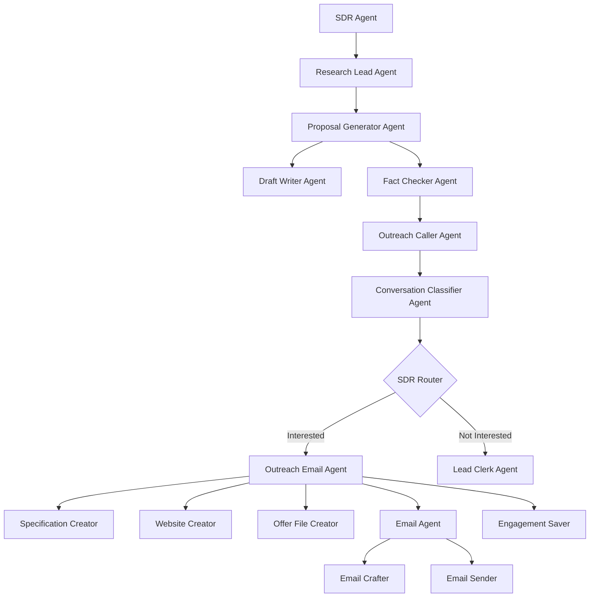

# >à SDR Agent - Sales Development Representative

The SDR (Sales Development Representative) Agent is a sophisticated multi-agent system designed to automate the entire sales outreach process for website development services. Built using Google's Agent Development Kit (ADK), it orchestrates comprehensive prospect research, personalized proposal generation, professional phone outreach, and email communication.

## =€ Features

- **Comprehensive Business Research**: Automated prospect analysis using Google Search
- **AI-Powered Proposal Generation**: Creates tailored proposals through generator-critic pattern
- **Professional Phone Outreach**: ElevenLabs conversational AI for natural business calls
- **Smart Call Classification**: Analyzes conversation outcomes and extracts key information
- **Conditional Workflow Routing**: Intelligent decision-making based on prospect responses
- **Email Automation**: Personalized email campaigns with attachments and tracking
- **Demo Website Creation**: Generates preview websites for prospects
- **BigQuery Analytics**: Comprehensive interaction tracking and performance metrics

## =Ë Table of Contents

- [Architecture](#architecture)
- [Installation](#installation)
- [Configuration](#configuration)
- [Usage](#usage)
- [Sub-Agents](#sub-agents)
- [Tools](#tools)
- [Workflow](#workflow)
- [API Documentation](#api-documentation)
- [Development](#development)
- [Deployment](#deployment)
- [Troubleshooting](#troubleshooting)

## <× Architecture

The SDR Agent follows a modular, multi-agent architecture with sequential and conditional execution patterns:



### Core Components

1. **Main SDR Agent**: SequentialAgent orchestrating the complete workflow
2. **Research System**: Google Search-powered business intelligence
3. **Proposal System**: Generator-critic pattern for quality proposals
4. **Communication System**: Phone and email outreach capabilities
5. **Routing System**: Conditional logic based on prospect responses
6. **Analytics System**: BigQuery integration for performance tracking

## =à Installation

### Prerequisites

- Python 3.9+
- Google Cloud Project with enabled APIs:
  - Custom Search API
  - Gmail API
  - BigQuery API
- ElevenLabs API account (for phone calls)
- Google ADK and A2A SDK

### Local Development Setup

1. **Clone the repository**:
```bash
git clone <repository-url>
cd salesshortcut
```

2. **Install dependencies**:
```bash
pip install -r sdr/requirements.txt
```

3. **Set environment variables**:
```bash
export GOOGLE_API_KEY="your-google-api-key"
export GOOGLE_CLOUD_PROJECT="your-gcp-project-id"
export ELEVENLABS_API_KEY="your-elevenlabs-api-key"
export ELEVENLABS_AGENT_ID="your-agent-id"
export ELEVENLABS_PHONE_NUMBER_ID="your-phone-number-id"
export EMAIL_USERNAME="your-email@gmail.com"
export EMAIL_PASSWORD="your-app-password"
```

4. **Start the SDR service**:
```bash
python -m sdr --port 8084
```

### Docker Installation

1. **Build the Docker image**:
```bash
docker build -f Dockerfile.sdr -t salesshortcut-sdr .
```

2. **Run the container**:
```bash
docker run -p 8084:8084 \
  -e GOOGLE_API_KEY="your-google-api-key" \
  -e ELEVENLABS_API_KEY="your-elevenlabs-api-key" \
  salesshortcut-sdr
```

## =' Configuration

### Environment Variables

| Variable | Description | Required | Default |
|----------|-------------|----------|---------|
| `GOOGLE_API_KEY` | Google API key for search and LLM | Yes | None |
| `GOOGLE_CLOUD_PROJECT` | GCP project ID for BigQuery | Yes | None |
| `ELEVENLABS_API_KEY` | ElevenLabs API key for calls | Yes | None |
| `ELEVENLABS_AGENT_ID` | ElevenLabs conversation agent ID | Yes | None |
| `ELEVENLABS_PHONE_NUMBER_ID` | ElevenLabs phone number ID | Yes | None |
| `EMAIL_USERNAME` | Gmail username for sending emails | Yes | None |
| `EMAIL_PASSWORD` | Gmail app password | Yes | None |
| `FROM_EMAIL` | Sender email address | Optional | EMAIL_USERNAME |
| `MODEL` | LLM model to use | Optional | gemini-2.0-flash-lite |
| `TEMPERATURE` | LLM temperature | Optional | 0.2 |

### Service Configuration

Create a `.env` file in the `sdr/` directory:

```env
# Core APIs
GOOGLE_API_KEY=your_google_api_key_here
GOOGLE_CLOUD_PROJECT=your_gcp_project_id
ELEVENLABS_API_KEY=your_elevenlabs_api_key
ELEVENLABS_AGENT_ID=your_agent_id
ELEVENLABS_PHONE_NUMBER_ID=your_phone_number_id

# Email Configuration
EMAIL_USERNAME=your_email@gmail.com
EMAIL_PASSWORD=your_app_password
FROM_EMAIL=your_email@gmail.com

# LLM Configuration
MODEL=gemini-2.0-flash-lite
TEMPERATURE=0.2
TOP_P=0.95
TOP_K=40

# BigQuery Configuration
DATASET_ID=sdr_data
TABLE_ID=sdr_results
```

## =Ö Usage

### Starting the SDR Agent

```bash
# Start the SDR service
python -m sdr --host 0.0.0.0 --port 8084

# Check service health
curl http://localhost:8084/health
```

### Triggering SDR Process

The SDR agent is typically triggered by the Lead Manager when a qualified lead needs outreach:

```python
# Example A2A message to SDR agent
message = {
    "business_name": "Acme Corp",
    "business_phone": "+1-555-1234",
    "business_email": "contact@acme.com",
    "business_address": "123 Main St, New York, NY",
    "lead_context": "Local restaurant without website"
}
```

### Manual Testing

```bash
# Test the SDR workflow with curl
curl -X POST http://localhost:8084/sdr \
  -H 'Content-Type: application/json' \
  -d '{
    "business_name": "Test Restaurant",
    "business_phone": "+1-555-9999",
    "business_email": "test@restaurant.com",
    "business_address": "456 Food St, Chicago, IL"
  }'
```

## > Sub-Agents

### 1. Research Lead Agent
**Purpose**: Conducts comprehensive business research

```python
# Located in: sdr/sub_agents/research_lead_agent.py
# Tools: Google Search API
# Output: research_result with business insights
```

**Capabilities**:
- Business background analysis
- Competitor research
- Market position assessment
- Website gap analysis
- Customer review analysis

### 2. Proposal Generator Agent
**Purpose**: Creates tailored proposals through generator-critic pattern

**Sub-agents**:
- **Draft Writer Agent**: Creates initial proposals
- **Fact Checker Agent**: Reviews and refines proposals

```python
# Located in: sdr/sub_agents/draft_writer_agent.py
# Located in: sdr/sub_agents/fact_checker_agent.py
# Output: proposal with personalized content
```

### 3. Outreach Caller Agent
**Purpose**: Makes professional phone calls to prospects

```python
# Located in: sdr/sub_agents/outreach_caller_agent.py
# Tools: ElevenLabs Conversational AI
# Output: call_result with transcript and outcome
```

**Features**:
- Phone number validation
- Natural conversation flow
- Transcript capture
- Call outcome tracking

### 4. Conversation Classifier Agent
**Purpose**: Analyzes call outcomes and extracts information

```python
# Located in: sdr/sub_agents/conversation_classifier.py
# Output: Structured classification with next actions
```

**Classifications**:
- `agreed_to_email`: Ready for email outreach
- `interested`: Potential follow-up needed
- `not_interested`: No further action
- `issue_appeared`: Technical problems occurred
- `other`: Miscellaneous outcomes

### 5. Outreach Email Agent
**Purpose**: Manages complete email campaign process

**Sub-agents**:
- **Specification Creator**: Creates detailed project specs (Loop Agent)
- **Website Creator**: Generates demo websites
- **Offer File Creator**: Creates PDF proposals
- **Email Agent**: Crafts and sends personalized emails
- **Engagement Saver**: Tracks email analytics

```python
# Located in: sdr/sub_agents/outreach_email_agent/
# Complex sequential workflow with multiple specialized agents
```

### 6. Lead Clerk Agent
**Purpose**: Saves interaction data for leads not ready for email outreach

```python
# Located in: sdr/sub_agents/lead_clerk_agent.py
# Tools: BigQuery integration
# Output: Comprehensive interaction logs
```

## =à Tools

### 1. Phone Call Tool
**File**: `sdr/tools/phone_call.py`

```python
from sdr.tools.phone_call import make_phone_call

# Make a professional phone call
result = make_phone_call(
    phone_number="+1-555-1234",
    business_name="Acme Corp",
    proposal_summary="Website development services"
)
```

**Features**:
- ElevenLabs Conversational AI integration
- Phone number validation
- Real-time call monitoring
- Transcript extraction
- Duplicate call prevention

### 2. BigQuery Tools
**File**: `sdr/tools/bigquery_utils.py`

```python
# Upload SDR interaction results
upload_sdr_results_to_bigquery(session_data)

# Track email engagement
upload_email_engagement_to_bigquery(email_data)

# Record successful conversions
upload_accepted_offers_to_bigquery(offer_data)
```

**Features**:
- Automatic table creation
- Structured data storage
- Analytics-ready format
- Comprehensive interaction logs

### 3. Gmail Service Account Tool
**File**: `sdr/tools/gmail_service_account_tool.py`

```python
# Send professional emails with attachments
send_email_with_attachment(
    to_email="prospect@company.com",
    subject="Website Development Proposal",
    body_html="<h1>Personalized proposal...</h1>",
    attachment_path="/path/to/proposal.pdf"
)
```

**Features**:
- Service account authentication
- HTML and plain text support
- File attachments
- Delivery confirmation

## =Ê Workflow

### Complete SDR Process

1. **Research Phase**:
   - Google Search analysis of target business
   - Competitor and market research
   - Website gap identification

2. **Proposal Phase**:
   - Draft personalized proposal
   - Fact-check and refine content
   - Generate compelling value proposition

3. **Outreach Phase**:
   - Validate phone number
   - Make professional phone call
   - Capture conversation transcript

4. **Classification Phase**:
   - Analyze call outcome
   - Extract key information
   - Determine next actions

5. **Conditional Routing**:
   - **If Interested**: Proceed to email campaign
   - **If Not Interested**: Save to analytics database

6. **Email Campaign** (if interested):
   - Create detailed project specifications
   - Generate demo website preview
   - Create PDF proposal document
   - Craft personalized email
   - Send email with attachments
   - Track engagement metrics

### State Management

The SDR agent maintains state across all sub-agents:

```python
# Session state includes:
{
    "business_info": {...},
    "research_result": {...},
    "proposal": {...},
    "call_result": {...},
    "classification": {...},
    "email_sent": boolean,
    "engagement_data": {...}
}
```

## = API Documentation

### A2A Integration

The SDR agent exposes an A2A-compatible interface:

```python
# Agent capabilities
capabilities = AgentCapabilities(
    skills=[
        AgentSkill(
            name="sdr_outreach",
            description="Complete SDR workflow from research to outreach"
        )
    ]
)
```

### REST Endpoints

```http
# Start SDR process
POST /sdr
Content-Type: application/json

{
  "business_name": "Target Business",
  "business_phone": "+1-555-1234",
  "business_email": "contact@target.com",
  "business_address": "123 Business Ave"
}

# Check agent status  
GET /health

# Get agent capabilities
GET /capabilities
```

## =à Development

### Running in Development Mode

```bash
# Install development dependencies
pip install -r sdr/requirements.txt

# Start with debug logging
python -m sdr --port 8084 --log-level DEBUG

# Enable hot reload (if using uvicorn directly)
uvicorn sdr.main:app --reload --port 8084
```

### Project Structure

```
sdr/
 __init__.py
 __main__.py                    # Entry point
 agent_executor.py             # A2A agent executor
 sdr/                          # Main agent package
    __init__.py
    agent.py                  # Main SDR agent
    config.py                 # Configuration
    prompts.py               # LLM prompts
    sub_agents/              # Sub-agent implementations
        research_lead_agent.py
        draft_writer_agent.py
        fact_checker_agent.py
        outreach_caller_agent.py
        conversation_classifier.py
        lead_clerk_agent.py
        sdr_router.py
        outreach_email_agent/
            outreach_email_agent.py
            sub_agents/
                specification_creator/
                website_creator/
                email_sender/
                engagement_saver_agent.py
 tools/                       # Utility tools
     phone_call.py
     bigquery_utils.py
     gmail_service_account_tool.py
```

### Adding New Sub-Agents

1. **Create the sub-agent class**:
```python
# sdr/sub_agents/new_agent.py
from google.adk.agents import BaseAgent

class NewAgent(BaseAgent):
    def run(self, session):
        # Agent implementation
        return session
```

2. **Add to main SDR agent**:
```python
# sdr/agent.py
from .sub_agents.new_agent import NewAgent

# Add to sequential workflow
sub_agents = [
    ResearchLeadAgent(),
    ProposalGeneratorAgent(),
    NewAgent(),  # Add here
    # ... other agents
]
```

3. **Update prompts**:
```python
# sdr/prompts.py
NEW_AGENT_PROMPT = """
Your prompt for the new agent...
"""
```

### Testing

```bash
# Run unit tests
pytest sdr/test/

# Test specific functionality
pytest sdr/test/test_phone_call.py

# Integration testing
python sdr/test/test_sdr_workflow.py
```

## =3 Deployment

### Docker Deployment

```bash
# Build image
docker build -f Dockerfile.sdr -t salesshortcut-sdr .

# Run container with environment variables
docker run -p 8084:8084 \
  -e GOOGLE_API_KEY="your-api-key" \
  -e ELEVENLABS_API_KEY="your-elevenlabs-key" \
  -e EMAIL_USERNAME="your-email@gmail.com" \
  salesshortcut-sdr
```

### Cloud Run Deployment

```bash
# Deploy to Google Cloud Run
gcloud run deploy sdr-service \
  --source . \
  --platform managed \
  --region us-central1 \
  --allow-unauthenticated \
  --set-env-vars GOOGLE_API_KEY="your-api-key"
```

### Production Configuration

```bash
# Set production environment variables
export GOOGLE_API_KEY="your-production-api-key"
export ELEVENLABS_API_KEY="your-production-elevenlabs-key"
export EMAIL_USERNAME="production-email@company.com"
export LOG_LEVEL="WARNING"
export MODEL="gemini-2.0-flash-lite"
```

## =
 Troubleshooting

### Common Issues

#### Phone Call Failures
```bash
# Check ElevenLabs configuration
curl -H "xi-api-key: $ELEVENLABS_API_KEY" \
  https://api.elevenlabs.io/v1/user

# Verify phone number format
python -c "import phonenumbers; print(phonenumbers.parse('+1-555-1234', 'US'))"
```

#### Email Sending Issues
```bash
# Test Gmail authentication
python -c "from sdr.tools.gmail_service_account_tool import test_gmail_auth; test_gmail_auth()"

# Check service account permissions
gcloud projects get-iam-policy $GOOGLE_CLOUD_PROJECT
```

#### BigQuery Connection Problems
```bash
# Verify BigQuery access
bq ls --project_id=$GOOGLE_CLOUD_PROJECT

# Test table creation
python -c "from sdr.tools.bigquery_utils import test_bigquery_connection; test_bigquery_connection()"
```

### Debugging

1. **Enable debug logging**:
```bash
python -m sdr --port 8084 --log-level DEBUG
```

2. **Check agent state**:
```python
# View session state during execution
logger.debug(f"Session state: {session.state}")
```

3. **Monitor API calls**:
```bash
# Watch HTTP traffic
export HTTPX_LOG_LEVEL=DEBUG
python -m sdr
```

### Performance Optimization

1. **Optimize LLM calls**:
```python
# Use lower temperature for consistent results
TEMPERATURE = 0.1

# Optimize token usage with focused prompts
```

2. **Cache research results**:
```python
# Implement result caching to avoid duplicate searches
```

3. **Batch BigQuery operations**:
```python
# Upload data in batches for better performance
```

## =Ê Monitoring

### Metrics and Analytics

```python
# Track key SDR metrics
conversion_rate = successful_emails / total_calls
engagement_rate = email_opens / emails_sent
meeting_rate = meetings_scheduled / interested_prospects
```

### Health Checks

```bash
# Monitor service health
curl http://localhost:8084/health

# Check agent capabilities
curl http://localhost:8084/capabilities
```

### Logging

```python
# Structured logging for analytics
logger.info("SDR workflow completed", extra={
    "business_name": business_name,
    "call_outcome": classification,
    "email_sent": email_sent,
    "duration_seconds": workflow_duration
})
```

## =Ä License

This project is licensed under the MIT License - see the [LICENSE](../LICENSE) file for details.

## <˜ Support

For issues, questions, or feature requests:

1. Check the [main README](../README.md) for general setup instructions
2. Review the troubleshooting section above
3. Check SDR agent logs for detailed error information
4. Verify all API keys and permissions are correctly configured
5. Open an issue on GitHub with detailed information about your problem

---

**Built with d for intelligent sales development automation**